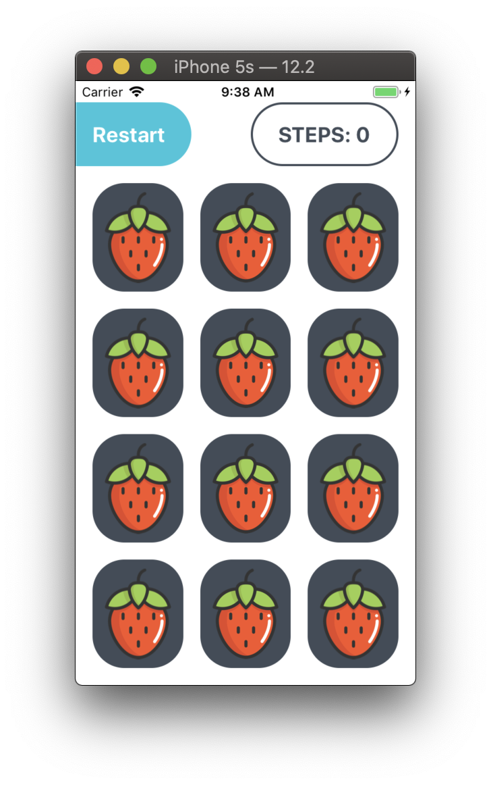
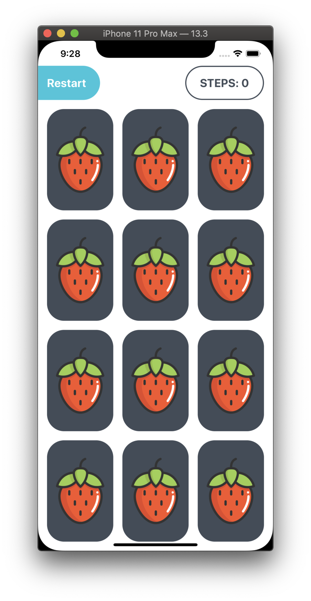
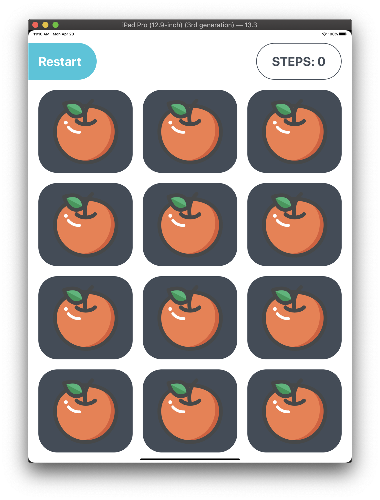
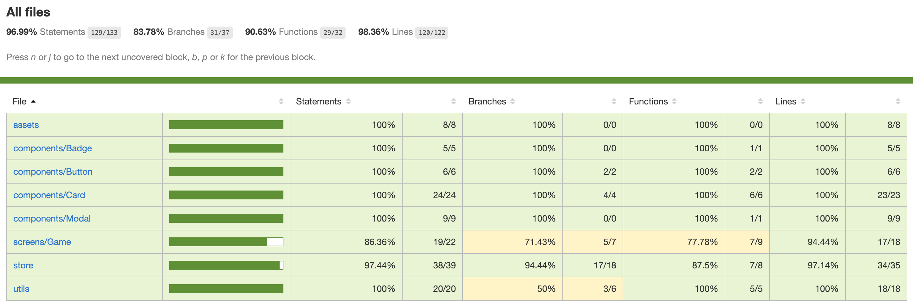

# FLIP CARD GAME

A fun and cute memory flip card game.

## 1. Installation

### Clone

- Clone this repo to your local machine using `git clone https://github.com/SaphiraNgocThuy/FlipCardGame.git`

### Setup

> Install dependencies

```shell
yarn install
```

> Run Expo

```shell
expo start
```

## 2. Demo

### Different screen sizes

| iphone 5s                                                   | iPhone 11 Pro Max                                                       | iPad Pro (12.9 inch)                                            |
| ----------------------------------------------------------- | ----------------------------------------------------------------------- | --------------------------------------------------------------- |
|  |  |  |

### Flow

[](https://www.youtube.com/watch?v=3U51u6eraCA&feature=youtu.be)

<video width="320" height="240" controls>
  <source src="https://www.youtube.com/watch?v=3U51u6eraCA&feature=youtu.be" type="video/mov">
</video>

### Test Coverage

 |

## 3. Built With

- Core

  - [React Native](https://facebook.github.io/react-native/) - Library to build Native Mobile Application
  - [Expo](https://docs.expo.io/versions/latest/) - React Native Client
  - [Redux](https://reactjs.org/) - Library for State Management
  - [Redux Thunk](https://github.com/reduxjs/redux-thunk) - Middleware for Async Redux
  - [Styled Components](https://www.styled-components.com/docs) - Library for creating CSS in JS

- Test
  - React’s [Test Renderer](https://reactjs.org/docs/test-renderer.html) - render React components to pure JS objects, without depending on the DOM or a native mobile environment
  - [react-native-testing-library](https://callstack.github.io/react-native-testing-library/) - builds on top of React’s test renderer and adds fireEvent and query APIs described in the next paragraph.
